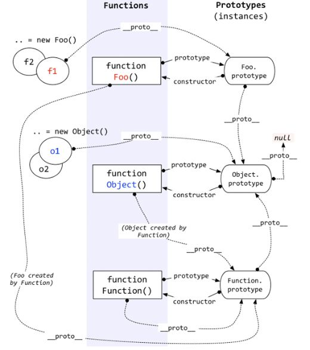

# 对象

## 1、顶层对象

ES环境中总是存在一个顶层对象，但不同的执行环境实现不统一。

| 环境 | 顶层对象 |
|---|---|
| 浏览器 | window、self |
| Web Worker | self |
| Node | global |

## 2、this

##### 顶层作用域 

全局环境下，返回顶层对象。但是在Node模块和ES6模块中，返回当前模块。

##### 函数

this取决于函数的调用方式，而非函数的定义方式。

以普通方法调用，非严格模式下返回顶层对象，严格模式下返回undefined。

以对象方法或构造方法调用，返回调用绑定的对象。

##### new Function

`new Function("return this;")`，返回全局对象。

## 3、原型



对象具有显式原型和隐式原型。

对象的隐式原型（`__proto__`），指向构造该对象的构造函数的显式原型。因此，通过构造函数创建的对象，可以访问构造函数原型中定义的属性和方法，当访问对象的属性时，如果在对象中不存在，则沿着隐式原型查找。

Function具有显式原型（`prototype`），指向原型对象，包含所有实例共享的属性和方法。原型对象的`constructor`指回构造函数。通过Function.prototype.bind方法构造的函数没有prototype属性。

Object的原型对象的隐式原型为null。

``` Js
function Foo(){}
let f1 = new Foo();
let f2 = new Foo();

//构造函数的显式原型指向构造函数
Foo.prototype.constructor === Foo
//实例的隐式原型指向其构造函数的原型对象
f1.__proto__ === f2.__proto__ === Foo.prototype
//构造函数的隐式原型指向Function的原型对象
Foo.__proto__ === Function.prototype
//原型对象的隐式原型指向Object的原型对象
Function.prototype.__proto__ === Object.prototype
//Object的原型对象没有隐式原型
Object.prototype.__proto__ === null
```