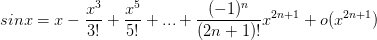
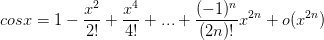

# 三角函数

## 泰勒公式

##### 1. 利用周期性变到(-2π, 2π]范围

```
sin(x + 2kπ) = sin(x)
cos(x + 2kπ) = cos(x)
```

##### 2. 利用奇偶性变到(-π, π]范围
```
sin(x + π) = -sin(x)
cos(x + π) = -cos(x)
```

##### 3. 利用诱导公式变到[0, π/2]范围
```
sin(π/2 - x) = cos(x)
cos(π/2 - x) = sin(x)
```

##### 4. 泰勒公式



