# 泰勒公式

## 带皮亚诺余项的n阶泰勒公式

设f(x)在点x=x0处具有n阶导数，则

>（式1）  
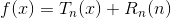

其中，

>（式2）  
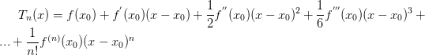

>（式3）  
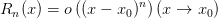

式1称为函数f(x)称为在点x=x0的邻域的带皮亚诺余项的n阶泰勒公式。

式2称为函数f(x)在点x=x0处的n次泰勒多项式。

式3称为函数f(x)在点x=x0处的n阶皮亚诺余项。

带皮亚诺余项的泰勒公式，定义在x0这一点上，因此也称为局部泰勒公式。

## 带拉格朗日余项的n阶泰勒公式

设f(x)在含有x0的区间(a,b)内有直到n+1阶的连续导数，则对∀x∈(a,b)，有

>（式4）  

其中
>（式5）  

>（式6）  
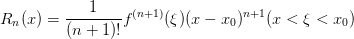

式4称为函数f(x)称为在区间(a,b)上带拉格朗日余项的n阶泰勒公式。

式6称为函数f(x)在点x=x0处的n阶拉格朗日余项。

带拉格朗日余项的泰勒公式，定义在一段区间上，因此也称为整体泰勒公式。

## 麦克劳林公式

在泰勒公式中取x0=0，称为麦克劳林公式。包括带皮亚诺余项的麦克劳林公式和带拉格朗日余项的麦克劳林公式。

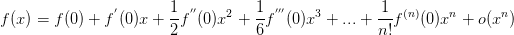

##### 常用麦克劳林公式

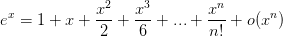

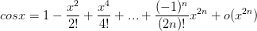

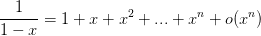

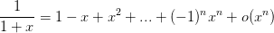

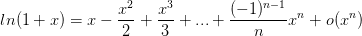

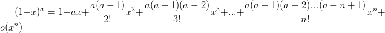