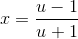

# log

计算对数函数，即log(x, y) = log<sub>x</sub>y。

## 自然对数

### 1. 辛普森公式

根据


辛普森公式

![\int_{a}^{b}f(x)dx \approx \frac{b-a}{6}[f(a) + 4f(\frac{a+b}{2}) + f(b)]](2.gif)

#### 实现

##### C#
``` C#
public static double Ln(double x)
{
    return ASR(1, x, 1e-8);
}

private static double ASR(double a, double b, double eps)
{
    return ASR(a, b, Simpson(a, b), eps);
}

private static double ASR(double a, double b, double A, double eps)
{
    double c = a + (b - a) / 2;
    double L = Simpson(a, c);
    double R = Simpson(c, b);
    if (Math.Abs(L + R - A) <= 15 * eps)
    {
        return L + R + (L + R - A) / 15;
    }

    return ASR(a, c, L, eps/2) + ASR(c, b, R, eps/2);
}

private static double Simpson(double a, double b)
{
    double c = a + (b - a) / 2;
    return (F(a) + 4 * F(c) + F(b)) * (b - a) / 6;
}

private static double F(double x)
{
    return 1 / x;
}
```

### 2. 黎曼和


两式相减得


令


则




## 任意底数的对数

应用换底公式即可：

