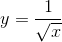
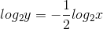
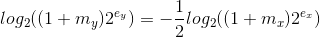
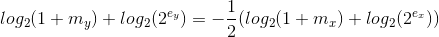
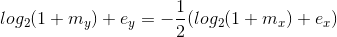

# 平方根

## 快速平方根倒数

浮点数表示必须符合IEEE754。

计算



两边取对数，则



浮点数可以表示为I=(1+m)2<sup>e</sup>，其中m是尾数（浮点数表示中最高有效位的1是省略的），e是指数（浮点数表示中的指数部分减去偏移量）。

对上式参数替换成浮点数表示







令


### 实现

##### C
``` C
float RSqrt(float number)
{
    const float threehalfs = 1.5F;
    float x2 = number * 0.5F;
    float y = number;

    int32_t i = *(int32_t*) &y;
    i = 0x5f3759df - (i >> 1);
    y = *(float*) &i;
    return y * (threehalfs - (x2 * y * y));
}
```

##### C#
``` C#
public static float RSqrt(float number)
{
    const float threehalfs = 1.5F;
    float x2 = number * 0.5F;
    float y = number;

    unsafe
    {
        int i = *(int*) &y;
        i = 0x5f3759df - (i >> 1);
        y = *(float*) &i;
        return y * (threehalfs - (x2 * y * y));
    }
}
```
