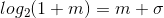
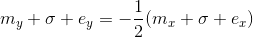

# 平方根

## 快速平方根倒数

浮点数表示必须符合IEEE754。

计算


两边取对数，则


浮点数可以表示为I=(1+m)2<sup>e</sup>，其中m是有效位（浮点数表示中最高有效位的1是省略的），e是指数（浮点数表示中的指数部分减去偏移量）。

对上式参数替换成浮点数表示


由于有效位m的范围是(0,1)，在这个范围内图像近似一条直线，因此可以直接替换为一次函数。

令



其中σ是一个用于调节的值极小的常数，

则



32位浮点数二进制表示为1位符号位、8位指数阶码、23位尾数。因此其二进制以整数形式解释为：I = EL + M，其中

- L = 2<sup>23</sup>（有23位尾数）
- E = e + B为指数阶码
- B = 127为指数偏移
- M = mL为尾数二进制位解释的整数值（尾数小数点右移23位）

开方时不考虑负数，因此符号位被忽略。

上式中的浮点数替换成以整数解释后


移项合并后


左右两边都有I = M + LE的形式，再次替换回浮点数后，


余项


是一个常数，只需要找到最合适的σ，使得的拟合效果最佳。


### 实现

##### C
``` C
float RSqrt(float number)
{
    const float threehalfs = 1.5F;
    float x2 = number * 0.5F;
    float y = number;

    int32_t i = *(int32_t*) &y;
    i = 0x5f3759df - (i >> 1);
    y = *(float*) &i;
    return y * (threehalfs - (x2 * y * y));
}
```

##### C#
``` C#
public static float RSqrt(float number)
{
    const float threehalfs = 1.5F;
    float x2 = number * 0.5F;
    float y = number;

    unsafe
    {
        int i = *(int*) &y;
        i = 0x5f3759df - (i >> 1);
        y = *(float*) &i;
        return y * (threehalfs - (x2 * y * y));
    }
}
```
