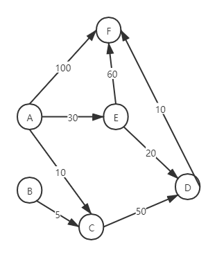

# Dijkstra

Dijkstra算法用于求解带权图中的单源最短路径，给定一个顶点，可以给出从该顶点到其他所有顶点的最短路径。图中的权重值必须非负。

Dijkstra算法采用贪心策略。设G=(V,E)是一个带权有向图，把图中顶点集合V分成两组，第一组为已求出最短路径的顶点集合（用S表示，初始时S中只有一个起始顶点，以后每求得一条最短路径，就将其加入到集合S中，直到全部顶点都加入到S中），第二组为其余未确定最短路径的顶点集合（用U表示），按最短路径长度的递增次序依次把第二组的顶点加入S中。

在加入的过程中，总保持从源点v到S中各顶点的最短路径长度不大于从源点v到U中任何顶点的最短路径长度。此外，每个顶点对应一个距离，S中的顶点的距离就是从v到此顶点的最短路径长度，U中的顶点的距离，是从v到此顶点只包括S中的顶点为中间顶点的当前最短路径长度。每次从U中选取距离最短的顶点加入S。

求图中A点到其他各点的最短路径。

图中共6个顶点，使用一个数组记录当前计算的A点到各个顶点的距离，S初始化为起点{A}，T初始化为其余顶点。每次从T中选取一个距离最小的顶点t加入S，并检查t的可达顶点，比较从t经过后的距离与已经计算的距离，若更小则更新路径。

| S | T | dis | 路径 |
|---|---|---|---|
| {A} | {B,C,D,E,F} | [0, ∞, 10, ∞, 30, 100] | A->B=∞ A->C=10 A->D=∞ A->E=30 A->F=100 |
| {A,C} | {B,D,E,F} | [0, ∞, 10, 60, 30, 100] | A->B=∞ A->C=10 <strong>A->C->D=60</strong> A->E=30 A->F=100 |
| {A,C,E} | {B,D,F} | [0, ∞, 10, 50, 30, 90] | A->B=∞ A->C=10 <strong>A->E->D=50</strong> A->E=30 <strong>A->E->F=90</strong> |
| {A,C,D,E} | {B,F} | [0, ∞, 10, 50, 30, 60] | A->B=∞ A->C=10 A->E->D=50 A->E=30 <strong>A->E->D->F=60</strong> |
| {A,C,D,E,F} | {B} | [0, ∞, 10, 50, 30, 60] | A->B=∞ A->C=10 A->E->D=50 A->E=30 A->E->D->F=60 |
| {A,B,C,D,E,F} | {} | [0, ∞, 10, 50, 30, 60] | A->B=∞ A->C=10 A->E->D=50 A->E=30 A->E->D->F=60 |