# 伸展树

伸展树是一棵二叉平衡树，但在每次查找操作后都对树进行调整，将其旋转向根结点推近一步，从而使该结点及其访问路径上的结点再次访问时效率提高。

最终伸展树可以保持查找频率高的结点更靠近根结点。

设要访问的结点为X，其父结点为P，祖父结点为G，则旋转可分为下面几种情况：
1. X是P的左结点，P是G的左结点。（LL)
2. X是P的左结点，P是G的右结点。（LR）
3. X是P的右结点，P是G的左结点。（RL)
4. X是P的右结点，P是G的右结点。（RR）

##### LL旋转

X是P的左结点，P是G的左结点。

对P先进行一次右单旋转，对X再进行一次右单旋转。

##### RR旋转

X是P的右结点，P是G的右结点。

对P先进行一次左单旋转，对X再进行一次左单旋转。

##### LR旋转

X是P的右结点，P是G的左结点。

对X执行左右双旋转。

##### RL旋转

X是P的左结点，P是G的右结点。

对X执行右左双旋转。

