# AVL树

AVL树（平衡二叉树）是每个结点的左子树和右子树的高度至多相差1的二叉搜索树。

## 插入

在AVL树中插入元素，为了保持平衡条件，需要进行旋转。记距离插入结点最近的被破坏平衡条件的结点为α，则分别有以下情况：
- 对α的左儿子的左子树进行插入（LL）
- 对α的左儿子的右子树进行插入（LR）
- 对α的右儿子的左子树进行插入（RL）
- 对α的右儿子的右子树进行插入（RR）

##### LL旋转

对α的左儿子k的左子树X插入，对k执行右单旋转。

##### RR旋转

对α的右儿子k的左子树X插入，对k执行左单旋转。

##### LR旋转

对α的左儿子m的右子树n进行插入（B或者C），执行左右双旋转。

##### RL旋转

对α的右子树m的左子树n进行插入（B或者C），执行右左双旋转。

## 删除
