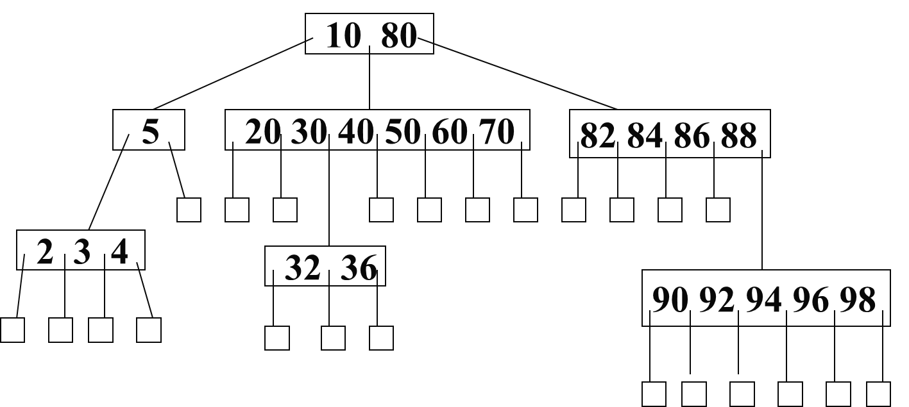

# B树

B树是一棵平衡多叉搜索树，m阶B树是平衡m叉搜索树，m≥3。

B树的定义有两种方式：阶数定义和最小度数定义。

##### 阶数定义

m阶B树满足以下性质：
1. 若根结点的度不为0，则至少为2，至多为m。
2. 除根结点和叶结点外，所有结点的度至少为⌊m/2⌋，至多为m。
3. 除根结点和叶结点外，所有结点的关键字个数恰好比度数少1。即，关键字个数至少为⌊m/2⌋-1，至多为m-1。
4. 所有叶结点深度相同。

##### 最小度数定义

B树的最小度数为t，则满足：
1. 若根结点的度不为0，则至少为2，至多为2t。
2. 除根结点和叶结点外，所有结点的度至少为t，至多为2t。
3. 除根结点和叶结点外，所有结点的关键字个数恰好比度数少1。即，关键字个数至少为t-1，至多为2t-1。
4. 所有叶结点的深度相同。

对m阶B树的任意非叶结点，Ti为子树，ki为结点的关键字，形成T0k0T1k1...Tn-2kn-2Tn-1的排列，满足：
1. 内部结点满足⌊m/2⌋ ≤ n ≤ m，根结点满足2 ≤ n ≤ m。即，内部结点满足t ≤ n ≤ 2t，根结点满足2 ≤ n ≤ 2t。
2. 子树T0的关键字都小于等于k0。
3. 子树Tn-1的关键字都大于kn-2。
4. 子树Ti(0＜i＜n-1)的关键字都大于ki-1，小于等于ki。
5. 结点上的关键字ki≤ki+1(0＜i＜n)。

以下是一棵7阶B树，内部结点至少有3棵子树，至多有7棵子树。

B树为磁盘存储设备而设计，能有效降低磁盘I/O操作次数。内存中以B树维护磁盘索引，结点上的关键字是磁盘页地址，对应数据是磁盘页的数据，当读取指定磁盘页的数据时，在B树中查找，如果存在，就返回该磁盘页；如果不存在，就读取连续的多个磁盘页，插入到B树中。

## 搜索

在m阶B树中查找关键字k。

由于B树的结点中存放多个有序的关键字，因此可以从根结点出发，依次递归查找每个结点，找到每个结点满足ki-1＜k≤ki的i：
1. 如果ki=k，则存在，即ki。
2. 否则，如果是叶结点，则不存在。
3. 否则，递归查找子树Ti。

## 插入

在m阶B树中插入关键字k。

1. 按照搜索的方式找到插入的位置，随后在该位置插入k。
2. 如果插入后的结点关键字个数小于等于m-1，插入过程结束。
3. 如果插入后的结点关键字个数多于m-1，当前结点分裂。以中间关键字为中心，分裂为两棵子树，左子树的关键字个数为⌊(m-1)/2⌋，右子树的关键字个数为m-⌊(m-1)/2⌋-1。随后将中间关键字递归插入父结点。

上述算法会导致回溯，即搜索的过程自上而下查找结点，插入的过程又自下而上递归插入。为了避免回溯，自上而下搜索时：每当遇到一个结点的关键字个数大于等于m-1，就立即分裂。然后根据插入的结点，从分裂后的左子树或者右子树开始，继续向下搜索要插入的结点。如果要插入的结点需要分裂，是先插入后分裂。

## 删除

在m阶B树中删除关键字k。

1. 查找k所在的结点P。
2  若P为非叶结点，将k右（左）侧子树中最小（大）关键字及其子树上移到k的位置。此时，视为递归在子结点中删除上移的关键字。结束。
3. 此时，P为叶结点。若P同时也为根结点，则直接删除关键字k。结束。
4. 若P的关键字数大于等于⌊m/2⌋，则直接删除关键字k。结束。
5. 此时，P的关键字数等于⌊m/2⌋-1。先删除关键字k，并做调整。
6. 若紧邻右（左）兄弟结点关键字数目大于等于⌊m/2⌋，将父结点中P右（左）侧的紧邻关键字下移到P中k的位置，将右（左）兄弟结点中最小（大）关键字上移到父结点中下移关键字的位置。结束。
7. 若不存在这样的紧邻兄弟结点，则P与紧邻右（左）兄弟合并，将父结点中相邻的关键字下移到合并后的结点中。
8. 若此时父结点是根结点，且关键字个数为0，则合并后的结点成为根结点，树的深度减少。
9. 否则，视为在父结点中递归删除了下移的关键字。

上述算法会导致回溯。优化为，从根结点向下搜索关键字的过程中，如果当前结点关键字数为⌊m/2⌋-1，则需要补充一个关键字。

1. 从根结点开始向下搜索。如果根结点只有一个关键字，且左右子树只有⌊m/2⌋-1个关键字，则合并左右子树，根结点的关键字一起合并进去。合并后的结点成为根结点。继续向下搜索。
2. 如果当前结点是叶结点，搜索k并直接删除。结束。
3. 当前结点是内部结点P，如果k在P中。
    1. 如果k的紧邻右（左）子结点Q的关键字个数大于⌊m/2⌋-1，则以Q的最小（大）关键字j替代P中的k，在Q中递归删除j。
    2. 否则，紧邻子结点的个数都为⌊m/2⌋-1，则合并两个紧邻子结点，k一并合并进去，随后在合并后的结点中递归删除k。
4. 如果k不在P中，记下一个遍历的子结点为Q。
    1. 如果Q的关键字个数大于⌊m/2⌋-1，则继续遍历Q。
    2. 否则，Q的关键字个数为⌊m/2⌋-1。如果Q的紧邻右（左）子兄弟结点关键字个数大于⌊m/2⌋-1，则其最小（大）关键字转移到Q中。
    3. 如果Q的紧邻右（左）子兄弟结点的关键字个数都为⌊m/2⌋-1，则合并Q与其中一个紧邻兄弟结点，并下移它们中间的父结点的对应关键字。随后在新结点中递归删除k。