# 二叉搜索树

二叉搜索树（二叉查找树，二叉排序树）是一棵二叉树，并且满足以下性质：
1. 如果存在左子树，那么左子树上所有节点的值都小于（小于等于）根节点的值；
2. 如果存在右子树，那么右子树上所有节点的值都大于等于（大于）根节点的值；
3. 左右子树也分别是二叉查找树。


当二叉搜索树用于实现集合时，不会存储相同的元素。

一棵有n个节点的二叉搜索树，其平均深度为O(log<sub>2</sub>n)，最大深度是n。

二叉查找树的最大元素是最右叶节点，最小元素是最左叶节点。

二叉搜索树的元素按照中序遍历的方式输出是有序的。

## 查找特定元素

时间复杂度为O(logn)。

##### 递归实现
```
TreeSearch(root, element)
    if root == NULL
        return NULL
    if element == root.value
        return root
    if element < root.value
        return TreeSearch(root.left, element)
    else
        return TreeSearch(root.right, element)
```

##### 迭代实现
```
TreeSearch(root, element)
    while x != NULL and element != root.value
        if k < root.value
            root = root.left
        else
            root = root.right
    return root
```

## 查找最大最小元素
```
TreeMin(node)
    while node.left != NULL
        node = node.left
    return node
    
TreeMax(node)
    while node.right != NULL
        node = node.right
    return node
```

## 插入

插入的过程与查找类似，从根结点开始向下搜索，直到叶结点，然后挂在这个叶节点的合适子结点上。

如果不允许存储相等元素，那么在搜索到相等元素时就返回。

时间复杂度为O(logn)

```
TreeInsert(T, node)
    x = T.root
    y = NULL
    while x != NULL
        y = x
        if node.value < x.value
            x = x.left
        else
            x = x.right
    
    //此时y是叶结点，新元素要挂到y上面
    node.parent = y
    
    //空树特殊实现
    if y == NULL
        T.root = node
    else if node.value < y.value
        y.left = node
    else
        y.right = node
```

## 删除

首先在二叉查找树中找到待删除元素所在的结点d，然后根据不同情况处理：
- 如果d是叶结点，则直接删除。
- 如果d只有一个子树，则删除后父结点直接连接其子结点。即用子树来替待d。
- 如果该结点有两个子树，则删除后寻找右子树的最小结点y（该结点不存在左子树），
    - 如果y是d的右子结点，用y替代d的位置。保留y的右子树，并连接d的左子树。
    - 否则，用y的右子树替代y的位置，随后用y替代d的位置。

##### 示例


- 删除3（叶结点）


- 删除4（一个子结点）


- 删除2（两个子结点）



```
//用子树y替代结点x，从而删除x
Transplant(T, x, y)
    //被替代的是根结点
    if x.parent == NULL
        T.root = y
    //被替代的是左子节点
    else if x == x.parent.left
        x.parent.left = y
    else
        x.parent.right = y
    if y != NULL
        y.parent = x.parent
```

```
//删除结点node
TreeDelete(T, node)
    //如果只有一个子结点，那么直接被替代；没有子结点的时候也适用
    if node.left == NULL
        Transplant(T, node, node.right)
        return
    if node.right == NULL
        Transplant(T, node, node.left)
        return
    
    tmp = TreeMin(node.right)
    if tmp.parent != node
        //先用右子树替代
        Transplant(T, tmp, tmp.right)
        //先把被删结点的右子树挂到tmp上
        tmp.right = node.right
        node.right.parent = tmp
        
    //然后替代被删除结点
    Transplant(T, node, tmp)
    tmp.left = node.left
    node.left.parent = tmp
```