# 伸展树

伸展树是一棵二叉平衡树，但在每次查找操作后都对树进行调整，将其旋转推至根结点，从而使该结点及其访问路径上的结点再次访问时效率提高。

最终伸展树可以保持查找频率高的结点更靠近根结点。

设要访问的结点为X，其父结点为P，祖父结点为G，则旋转可分为下面几种情况：
1. X是P的左结点，P是G的左结点。
2. X是P的左结点，P是G的右结点。
3. X是P的右结点，P是G的左结点。
4. X是P的右结点，P是G的左结点。

### 单旋转

##### 右单旋转

X是P的左结点，P是G的左结点。

对P先进行一次右单旋转：
1. P代替父结点G的位置，G成为P的右结点。
2. P的右结点C成为G的左结点。

对X再进行一次右单旋转：
1. X替代父结点P的位置，P成为X的右结点。
2. X的右结点B成为P的左结点。

##### 左单旋转

X是P的右结点，P是G的右结点。

对P先进行一次左单旋转：
1. P替代父结点G的位置，G成为P的左结点。
2. P的左结点B成为G的右结点。

对X再进行一次左单旋转：
1. X替代父结点P的位置，P成为X的左结点。
2. X的左结点C成为P的右结点。

### 双旋转

##### 左-右双旋转

X是P的右结点，P是G的左结点。对X执行左-右双旋转。

对X第一次左单旋转：
1. X代替父结点P的位置，P成为X的左结点。
2. X的左结点B成为P的右结点。

对X第二次右单旋转：
1. X代替父结点G的位置，G成为X的右结点。
2. X的右结点C成为G的左结点。

##### 右-左双旋转

X是P的左结点，P是G的右结点。对X执行右-左双旋转。

对X第一次右单旋转：
1. X代替父结点P的位置，P成为X的右结点。
2. X的右结点B成为P的左结点。

对X第二次左单旋转：
1. X代替父结点G的位置，G成为X的左结点。
2. X的左结点成为G的右结点。

