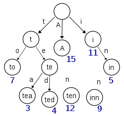

# 字典树

字典树，也称作前缀树、Trie树、单词查找树，是一种有序树，用于保存关联数组，其中的键通常是字符串。与二叉查找树不同，键不是直接保存在结点中，而是由结点在树中的位置决定，结点的位置即表示结点对应的字符串，而根结点对应空字符串。一个结点的所有子孙都有相同的前缀。不是所有的结点都有对应的值，只有叶子结点和部分内部结点所对应的键才有值。

字典树用于统计、排序和保存大量的字符串，所以经常被搜索引擎用于文本词频统计。字典树的优点是：利用字符串的公共前缀来减少查询时间，最大限度地减少无谓的字符串比较，查询效率比哈希树高。

字典树具有以下性质：
1. 根结点表示空字符串，不包含字符，除根结点外每个结点只包含一个字符。
2.每个结点的子结点包含的字符不相同。
3.从根结点到某结点，路径上经过的字符连接起来就是该结点对应的字符串。

