# 平衡二叉树

平衡二叉树（平衡二叉搜索树，AVL树）是每个结点的左子树和右子树的高度至多相差1的二叉搜索树。

## 一、插入

在AVL树中插入元素，为了保持平衡条件，需要进行旋转。记距离插入结点最近的被破坏平衡条件的结点为α，则分别有以下情况：
- 对α的左儿子的左子树进行插入（左左）
- 对α的左儿子的右子树进行插入（左右）
- 对α的右儿子的左子树进行插入（右左）
- 对α的右儿子的右子树进行插入（右右）

### 单旋转

##### 左左右单

对α的左儿子k的左子树X插入，执行右单旋转：
1. k替代α的位置，α成为k的右子树
2. k的右子树Y成为α的左子树

##### 右右左单

对α的右儿子k的左子树X插入，执行右单旋转：
1. k替代α的位置，α成为k的左子树
2. k的左子树X成为α的右子树

### 双旋转

##### 左右双旋

对α的左儿子m的右子树n进行插入（B或者C），执行左-右双旋转。

第一次旋转：
1. n替代m的位置，m成为n的左子树
2. n的左子树B成为m的右子树

第二次旋转：
1. n替代α的位置，α成为n的右子树
2. n的右子树C成为α的左子树

##### 右左双旋

对α的右子树n的左子树n进行插入（B或者C），执行右-左双旋转。

第一次旋转：
1. n替代m的位置，m成为n的右子树
2. n的右子树C成为m的左子树

第二次旋转：
1. n替代α的位置，α成为n的左子树
2. n的左子树B成为α的右子树

