# 平衡二叉树的旋转

各类平衡二叉树的插入和删除操作都涉及到旋转。

```
// 移植结点y替代结点x
Transplant(x, y)
    if (x.parent == null)
        root = y
    elseif (x == x.parent.left)
        x.parent.left = y
    else
        x.parent.right = y
        
    if (y != null)
        y.parent = x.parent
```

## 左单旋转


```
LeftRotation(node)
    var parent = node.parent
    Transplant(parent, node)
    parent.right = node.left
    if (node.left != null)
        node.left.parent = parent
    node.left = parent
    parent.parent = node
```

## 右单旋转 



对结点k执行右单旋转：
1. k替代α的位置，α成为k的右子树
2. k的右子树Y成为α的左子树

```
RightRotation(node)
    var parent = node.parent
    Transplant(parent, node)
    parent.left = node.right
    if (node.right != null)
        node.right.parent = parent
    node.right = parent
    parent.parent = node
```

## 左右双旋转


对结点n执行左右双旋转。

第一次对n执行左单旋转：
1. n替代m的位置，m成为n的左子树
2. n的左子树B成为m的右子树

第二次对n执行右单旋转：
1. n替代α的位置，α成为n的右子树
2. n的右子树C成为α的左子树

## 右左双旋转


对结点n执行右左双旋转。

第一次对n执行右单旋转：
1. n替代m的位置，m成为n的右子树
2. n的右子树C成为m的左子树

第二次对n执行左单旋转：
1. n替代α的位置，α成为n的左子树
2. n的左子树B成为α的右子树
