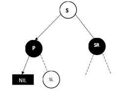
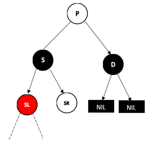
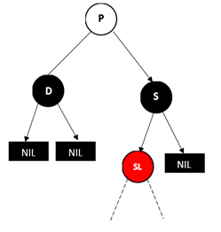

# 红黑树

红黑树是一棵二叉搜索树，树中的每一个结点都被标记上黑色或者红色，并满足：
1. 根结点和所有叶结点是黑色。
2. 从根结点到叶结点的路径上没有连续两个红色结点，但可以有连续的黑色结点。
3. 所有从根结点到叶结点的路径都有相同数目的黑色结点。

父结点到黑色子结点的指针称为黑色指针，父结点到红色子结点的指针称为红色指针，则上述条件等价于：
1. 指向叶结点的指针是黑色。
2. 根结点到叶结点的路径上没有连续两个红色指针，但可以有连续的黑色指针。
3. 所有根结点到叶结点的路径上都有相同数目的黑色指针。

红黑树的数据都存储在非叶结点上，叶结点不存储数据。因此将叶结点称为外部结点，非叶结点称为内部结点。红黑树的叶结点是虚拟出的结点，方便旋转。

##### 黑高度

红黑树的结点x到叶结点的路径上黑色结点的个数（不包括结点x本身），称为结点x的黑高度（阶），记作bh(x)。

注意结点x到任一根结点的路径上黑色结点的个数是相等的。

##### 路径长度

红黑树的路径长度是路径上的指针个数，记作PL。

## 推论

1、若P与Q是红黑树中两条从根结点到叶结点的路径，则有PL(P)≤2PL(Q)。

2、一棵有n个非叶结点的红黑树高度至多为2log(n+1)。

3、红黑树的高度至多为根结点的黑高度的2倍。

4、设r为红黑树根结点的黑高度，则红黑树的结点个数至少为2r-1。

## 插入

将关键字k插入红黑树，首先通过二叉搜索树搜索，将新结点插入到最外层的内部结点。随后对结点染色并调整。

1 如果插入前是空树，则新插入的结点成为根结点，并染上黑色，为其引入两个外部结点。插入完成。

2 否则，将新结点染上红色。设新结点为X，其父结点为P，父结点的兄弟结点为PP，祖父结点为G。

2.1 若P是黑色结点，则插入完成。

2.2 若P是红色结点，则G是黑色结点。分为两种情况。

2.2.1 若PP是红色结点，则将G染上红色，P和PP染上黑色。此时，若G是根结点，则染上黑色；否则，将G递归向上调整。

2.2.2 若PP是黑色结点，则再分为四种情况。

2.2.2.1 若X是P是左子结点，P是G的左子结点，则将X向右单旋转。P染上黑色，G染上红色。

2.2.2.2 若X是P的右子结点，P是G的左子结点，则将X执行左-右双旋转。X染上黑色，G染上红色。

2.2.2.3 若X是P的右子结点，P是G的右子结点，则将X向左单旋转。P染上黑色，G染上红色。

2.2.2.4 若X是P的左子结点，P是G的右子结点，则将X执行右-左双旋转。X染上黑色，G染上红色。

## 删除

从红黑树中删除关键字k，首先按照二叉搜索树搜索找到要删除的结点。

1、若删除的是红色结点。

1.1、若删除的是最外层内部结点，则直接删除。

 

1.2、若删除的是非最外层的内部结点，则该结点必然左右子树都存在。以其子结点的值代替被删除结点的值，并递归删除子结点。

2、若删除的是黑色结点。

2.1、若删除的是最外层内部结点。

2.1.1、若被删除结点D的兄弟结点S为红色。

（1）若D是左结点。则父结点P和兄弟结点S的颜色互换，即P染上红色，S染上黑色。随后对P进行左单旋转。从当前情况继续删除D，跳到2.1.2。

 

（2）若D是右结点。则父结点P和兄弟结点S的颜色互换，即P染上红色，S染上黑色。随后对P进行右单旋转。从当前情况继续删除D，跳到2.1.2。

 

2.1.2、若被删除结点D的兄弟结点S为黑色。

2.1.2.1、若远侄结点为红色结点。

（1）若D是左结点，S的右结点SR为红色结点。此时，S的左结点SL可以是红色结点，也可以是黑色叶结点。

将父结点P和兄弟结点S的颜色互换，SR染上黑色。随后对P进行左单旋转，最后直接删除D。

 

（2）若D是右结点，S的左结点SL为红色结点。此时，S的右结点SR可以是红色结点，也可以是黑色叶结点。

将父结点P和兄弟结点S的颜色互换，SL染上黑色。随后对P进行右单旋转，最后直接删除D。

 

2.1.2.2、若远侄结点为黑色结点，近侄结点为红色结点。

（1）若D是左结点，S的左结点SL为红色，S的右结点SR为黑色结点（必为叶结点）。将SL进行右单旋转，S与SL的颜色互换，即S染上红色，SL染上黑色。从当前情况继续删除D，跳到2.1.2.1。

 

（2）若D是右结点，S的右结点SR为红色，S的左结点SL为黑色结点（必为叶结点）。将SR进行左单旋转，S与SR的颜色互换，即S染上红色，SR染上黑色。从当前情况继续删除D，跳到2.1.2.1。

 

2.1.2.3、若S的两个结点都为黑色结点，则S必然是最外层内部结点。

2.1.2.3.1、若D的父结点P为红色结点。将P染上黑色，S染上红色，最后直接删除D。

 

2.1.2.3.2、若D的父结点P为黑色结点。直接删除D，将S染上红色，随后以P为中心递归调整。

2.2、若删除的是非最外层的内部结点。

2.2.1、若删除的结点D存在两个子结点，则以子结点的关键字代替D的关键字，随后递归删除子结点。

2.2.2、若删除的结点D只存在一个子结点，则子结点必然为红色结点。则以子结点直接替代被删除的结点，并染上黑色。

 