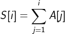
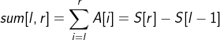
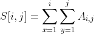
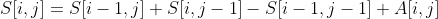

# 前缀和

## 一维前缀和

对于给定的数列A，其元素i对应的前缀和数列S为：

则数列A中下标区间[l, r]内的元素和，可以表示为前缀和的差的形式：

| i | 0 | 1 | 2 | 3 | 4 | 5 | 6 |
|---|---|---|---|---|---|---|---|
| A | 1 | 2 | 3 | 4 | 5 | 6 | 7 |
| S | 1 | 3 | 6 | 10 | 15 | 21 | 28 |

##### 应用

- 目标和
- 目标模

## 二维前缀和

对于给定的二维数组A，其元素(i,j)对应的前缀和数列S为：

则S的递推式为：

- 最大正方形