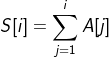

# 前缀和

对于给定的数列A，其对应的前缀和数列S的递推公式为：

则数列A中下标区间[l, r]内的元素和，可以表示为前缀和的差的形式：

| i | 0 | 1 | 2 | 3 | 4 | 5 | 6 |
|---|---|---|---|---|---|---|---|
| A | 1 | 2 | 3 | 4 | 5 | 6 | 7 |
| S | 1 | 3 | 6 | 10 | 15 | 21 | 28 |

## 应用

- [目标和](../../序列/其他/目标和)
- [目标模](目标模)