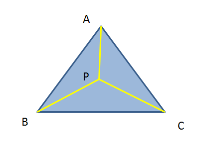

# 判断点在三角形内

给定平面上的三角形ABC和点P(x, y)，判断P是否在三角形内。

## 一、内角和法

连接点P和三角形各个顶点得到三条线段PA、PB、PC，求出三条线段与三角形各边夹角。若所有夹角之和为180°，则P在三角形内；否则，P在三角形外。

即，判断∠PAB+∠PAC+∠PCA+∠PCB+∠PBC+∠PBA是否等于180°。

## 二、同向法

沿着三角形的边ABCA方向移动时，在三角形内部的点P始终与所在边的对应点同侧。因此只需要分别验证（1）点P和点C在边AB同侧，（2）点P和点A在边BC同侧，（3）点P和点B在边AC同侧。

判断点P和点C是否在AB同侧，分别计算AP与AB的叉积，AC与AB的叉积。如果两个叉积的结果方向一致，则点P和点C在AB的同侧。

判断两个向量是否同向，对两向量作点积，结果大于0，则同向。

## 三、重心法

任取三角形的一个顶点A作为原点，以该顶点出发的两条边AB和AC作为基底，构建坐标系，则点P可以表示为`P=A+u(C-A)+v(B-A)`。

点P在三角形内部，满足：
- u≥0
- v≥0
- u+v≤1

令x=C-A，y=B-A，t=P-A，则t=ux+vy。

左右两边分别点乘x和y，可得：
- t·x = (ux+vy)·x
- t·y = (ux+vy)·y

展开得：
- t·x = u(x·x) + v(y·x)
- t·y = u(x·y) + v(y·y)

解得：
- u = ((y·y)(t·x)-(y·x)(t·y)) / ((x·x)(y·y) - (x·y)(y·x))
- v = ((x·x)(t·y)-(x·y)(t·x)) / ((x·x)(y·y) - (x·y)(y·x))