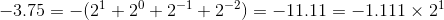

# IEEE754

二进制浮点数算术标准，定义了浮点数的二进制格式。

一个浮点数表示为：`sign * exponent * fraction`。

最高位是**符号位**，其后e位是**指数阶码**，剩余位是**尾数**。

指数阶码即指数的一个固定偏移值，实际的指数值等于指数阶码减去2e-1-1。之所以按照阶码的形式存储，是因为指数必须是一个有符号数，偏移值比补码形式对比较更容易。

如果浮点数指数阶码范围在[1, 2e-2]内，且最高有效位是1，即表示为1.ddd\*2n的形式，则称这个浮点数为**规约浮点数**，即可以用唯一确定的形式表示的值。最高有效位1应当在尾数中忽略。

如果指数阶码为0，尾数非0，即表示为0.ddd\*2n的形式，则称这个浮点数为**非规约浮点数**。非规约形浮点数指数实际值为阶码减去偏移量加1。

如果指数阶码为0，且尾数为0，则根据符号位表示+0或-0。

如果指数阶码为2e-1，且尾数为0，则根据符号位表示+∞或-∞。

如果指数阶码为2e-1，且尾数非0，则表示NaN。

总结如下：

| 数值 | 指数 | 尾数 |
|---|---|---|
| 0 | 0 | 0 |
| 非规约 | 0 | (0,1) |
| 规约 | [1, 2e-2] | [1,2) |
| ∞ | 2e-1 | 0 |
| NaN | 2e-1 | 非0 |

## 单精度浮点数（32位）
1位符号位，8位指数阶码，23位尾数。阶码偏移为127，实际表示的指数范围为[-126, 127]。非规约指数阶码实际表示的指数为-126。

最小非规约数为±2−23 × 2−126 = ±2−149 ≈ ±1.4×10-45

最大非规约数为±(1-2−23) × 2−126 = ±2−149 ≈ ±1.18×10-38

最小规约数为±2−126 ≈ ±1.18×10-38

最大规约数为±(2-2−23) × 2127 ≈ ±3.4×1038

例如

- 符号位为1。
- 指数为1，阶码为128，8位二进制表示为1000 0000。
- 有效位为1111，忽略最高位1，尾数为111 0000 0000 0000 0000 0000。

因此，-3.75的单精度浮点数表示为1100 0000 0111 0000 0000 0000 0000 0000。

## 双精度浮点数（64位）

1位符号位，11位指数阶码，52位尾数。阶码偏移为1023，实际表示的指数范围为[-1022, 1023]。非规约指数阶码实际表示的指数为-1022。