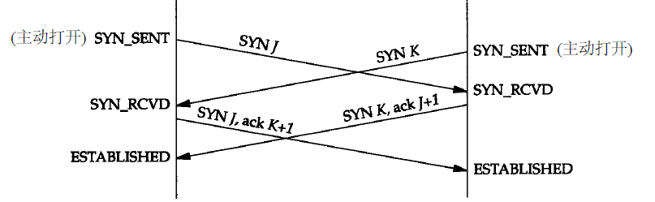
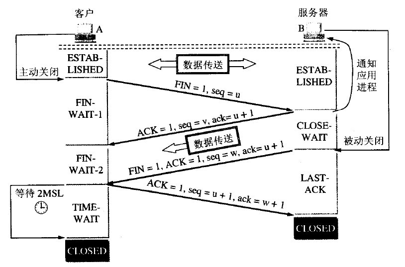
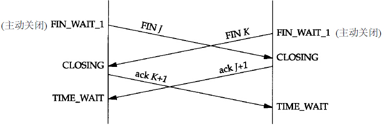
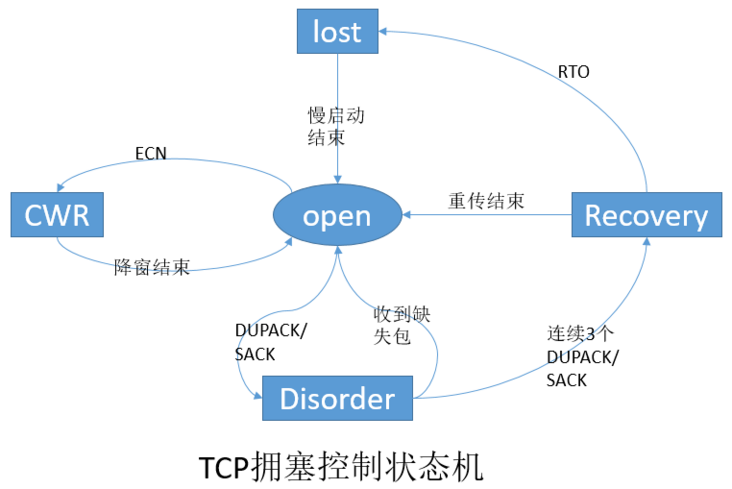
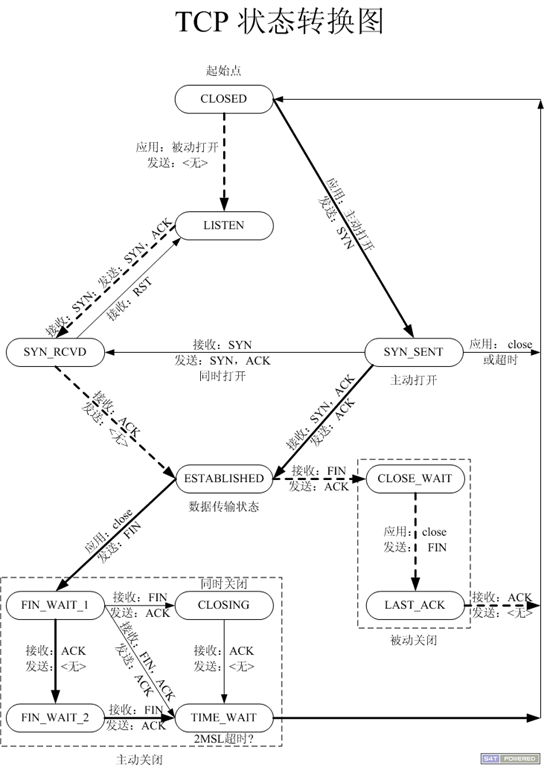

# TCP

Transmission Control Protocol

传输控制协议

TCP是一种面向连接的、可靠的、基于字节流的传输层协议，在RFC 793中定义。

TCP有以下特点：
- 面向连接。应用程序在使用TCP协议之前，必须先建立TCP连接；在传输数据完毕后，必须释放已经建立的连接。TCP连接只能是点对点的。
- 可靠。通过TCP连接传送的数据，无差错、不丢弃、不重复地按序到达。TCP使用停止等待协议来进行可靠传输。
- 基于字节流。TCP不负责分包，可能导致粘包。

每一条TCP连接由通信两端的两个套接字（IP地址和端口）确定。

## 一、TCP报文格式

TCP报文封装在IP数据报的数据部分。

<table>
	<tr>
		<th>位</th>
		<th colspan="16">16</th>
		<th colspan="16">16</th>
	</tr>
	<tr>
		<th>字段</th>
		<td colspan="16">源端口</td>
		<td colspan="16">目的端口</td>
	</tr>
	<tr>
		<th>位</th>
		<th colspan="32">32</th>
	</tr>
	<tr>
		<th>字段</th>
		<td colspan="32">序号（seq）</td>
	</tr>
	<tr>
		<th>位</th>
		<th colspan="32">32</th>
	</tr>
	<tr>
		<th>字段</th>
		<td colspan="32">确认号（ack）</td>
	</tr>
	<tr>
		<th>位</th>
		<th colspan="4">4</th>
		<th colspan="6">6</th>
		<th colspan="1">1</th>
		<th colspan="1">1</th>
		<th colspan="1">1</th>
		<th colspan="1">1</th>
		<th colspan="1">1</th>
		<th colspan="1">1</th>
		<th colspan="16">16</th>
	</tr>
	<tr>
		<th>字段</th>
		<td colspan="4">首部长度</td>
		<td colspan="6">0</td>
		<td colspan="1">URG</td>
		<td colspan="1">ACK</td>
		<td colspan="1">PSH</td>
		<td colspan="1">PST</td>
		<td colspan="1">SYN</td>
		<td colspan="1">FIN</td>
		<td colspan="16">窗口大小</td>
	</tr>
	<tr>
		<th>位</th>
		<th colspan="16">16</th>
		<th colspan="16">16</th>
	</tr>
	<tr>
		<th>字段</th>
		<td colspan="16">检验和</td>
		<td colspan="16">紧急指针</td>
	</tr>
	<tr>
		<th>位</th>
		<th colspan="32">可变</th>
	</tr>
	<tr>
		<th>字段</th>
		<td colspan="32">选项</td>
	</tr>
	<tr>
		<th>位</th>
		<th colspan="32">可变</th>
	</tr>
	<tr>
		<th>字段</th>
		<td colspan="32">数据部分</td>
	</tr>
</table>

##### 序号（seq）

TCP连接中传送的每一个字节都按顺序编号，该字段表示本报文段发送的数据第一个字节的序号。

##### 确认号（ack）

期望收到对方下一个报文段第一个数据字节的序号。

##### 首部长度	

单位为4字节。最小值为5，最大值为12。

##### URG	

URG=1时，表示紧急指针字段有效。

##### ACK	

ACK=1时，表示确认号字段有效，连接建立后传送的报文都必须把ACK置为1。

##### PSH	

PSH=1时，表示该报文应当尽快交付给应用进程。

##### RST	

RST=1时，表示（1）必须释放连接并重新建立，或（2）拒绝非法报文段，或（3）拒绝打开连接。

##### SYN	

连接建立时用来同步序号。当SYN=1，ACK=0时，表示连接请求；当SYN=1，ACK=1时，表示对连接请求的接受响应。

##### FIN	

FIN=1时，表示要求释放连接。

##### 窗口大小	

发送方的接收窗口大小。

##### 检验和	

在数据报之前添加12字节的伪首部，并计算整个报文。

TCP伪首部定义如下：

<table>
	<tr>
		<th>字节</th>
		<th>4</th>
		<th>4</th>
		<th>1</th>
		<th>1</th>
		<th>2</th>
	</tr>
	<tr>
		<th>字段</th>
		<td>源IP地址</td>
		<td>目的IP地址</td>
		<td>0</td>
		<td>6</td>
		<td>TCP长度</td>
	</tr>
</table>
		
##### 紧急指针	

仅在URG=1时有效，描述紧急数据的字节数。紧急数据位于数据部分的最前面。

##### 选项	

连续多个选项字段。

## 二、TCP选项

#### 选项表结束

<table>
	<tr>
		<th>字节</th>
		<th>1</th>
	</tr>
	<tr>
		<th>字段</th>
		<td>类型（0）</td>
	</tr>
</table>

#### 无操作
<table>
	<tr>
		<th>字节</th>
		<th>1</th>
	</tr>
	<tr>
		<th>字段</th>
		<td>类型（1）</td>
	</tr>
</table>

#### 最大报文段长度（MSS）
<table>
	<tr>
		<th>字节</th>
		<th>1</th>
		<th>1</th>
		<th>2</th>
	</tr>
	<tr>
		<th>字段</th>
		<td>类型（2）</td>
		<td>长度（4）</td>
		<td>最大报文段长度</td>
	</tr>
</table>

#### 窗口扩大因子
<table>
	<tr>
		<th>字节</th>
		<th>1</th>
		<th>1</th>
		<th>1</th>
	</tr>
	<tr>
		<th>字段</th>
		<td>类型（3）</td>
		<td>长度（3）</td>
		<td>移位数</td>
	</tr>
</table>

#### 时间戳
<table>
	<tr>
		<th>字节</th>
		<th>1</th>
		<th>1</th>
		<th>4</th>
		<th>4</th>
	</tr>
	<tr>
		<th>字段</th>
		<td>类型（8）</td>
		<td>长度（10）</td>
		<td>时间戳</td>
		<td>时间戳回显应答</td>
	</tr>
</table>

## 三、建立连接

TCP连接建立的过程中并未传输数据，因此seq只加1。

#### 初始序号（ISN）

TCP的报文序号占4个字节，序号标识每一个需要传输的数据字节。报文中的seq字段描述了当前报文数据第一个字节的序号。如果报文不包含数据，则报文本身占用一个序号。

TCP建立一个新的连接时，客户端和服务端需要分别随机生成各自初始序号。

#### TCP连接建立

第一个包：客户端向服务端发送SYN包，包括SYN和初始seq。客户端进入SYN-SEND状态，随后等待服务端的ACK包，如果未能收到服务端的ACK包，客户端需要超时重传SYN包。

第二个包：服务端收到SYN包后，向客户端回复ACK包，包括SYN、ACK、初始seq和ack，ack等于SYN包的seq+1。服务端进入SYN-RCVD状态，随后等待客户端的ACK包，如果未能收到客户端的ACK包，服务端需要超时重传ACK包。

第三个包：客户端收到ACK包后，向服务端回复ACK包，包括ACK、seq和ack，seq等于客户端初始seq+1，ack等于服务端初始seq+1，客户端ACK包也可以带上需要发送的初始数据。随后客户端进入ESTABLISHED状态，服务端收到客户端的ACK包后，也进入ESTABLISHED状态。客户端的ACK包不会超时重传。

三次握手的目的在于，能使服务端再确认一次。客户端发出的SYN包可能在某个网络结点滞留，客户端因超时重传了该包后，滞留的SYN包又到达服务端，防止服务端认为其是一个新的连接请求。

在第三个包丢失的情况下，客户端单方面进入ESTABLISHED状态，服务端保持SYN-RCVD状态。服务端会周期性重传服务端ACK包，直到收到客户端的ACK包。

#### TCP连接同时建立

当主机A以端口x向主机B的端口y请求建立连接的同时，主机B以端口y向主机A的端口x请求建立连接，此时会导致TCP连接同时建立。

## 四、释放连接

#### TCP连接释放

释放连接可以由客户端发起，也可以由服务端发起。

第一个包：客户端向服务端发送FIN包，客户端进入FIN-WAIT-1状态（半关闭状态）。此时停止从客户端向服务端发送用户数据，但是客户端仍然能从服务端接收数据。

第二个包： 服务端收到客户端的FIN包后，向客户端回复ACK包，服务端进入CLOSE-WAIT状态（半关闭状态）。此时停止从服务端向客户端发送用户数据。

客户端收到服务端的ACK包后，进入FIN-WAIT-2状态，此时客户端到服务端方向的连接完全关闭。

第三个包：服务端进入CLOSE-WAIT状态后，再次向客户端发送FIN包，包括FIN和ACK。服务端进入LAST-ACK包。

第四个包：客户端收到服务端的FIN包后，向服务端回复ACK包。客户端进入TIME-WAIT状态，等待2MSL（报文段最大生存时间）后，进入CLOSED状态，释放TCP连接。

服务端收到客户端的ACK包后，进入CLOSED状态，释放TCP连接。

四次握手的目的在于允许半关闭连接。

MSL（报文最大生存时间）是任何报文在网络上存在的最大时间，超过这个时间的报文被丢弃。主动关闭方最后要等待2MSL后才关闭连接，保证这次连接的重复数据包已经从网络中消失。原因在于：
1. 如果客户端直接CLOSED了，那么由网络原因导致服务端没有收到客户端最后回复的ACK包后，服务端会超时重传FIN。此时由于客户端已经CLOSED了，无法找到与重发的FIN包对应的连接，客户端只能向服务端发RST包而不是ACK包，服务端会认为是连接错误报告给上层。这样的情况虽然不会造成数据丢失，但是却导致TCP协议不符合可靠连接的要求。所以，客户端不是直接进入CLOSED，而是要保持TIME_WAIT，当再次收到FIN的包时候，能够保证对方收到ACK包，并正确地关闭连接。
2. 如果客户端直接CLOSED，然后又再向服务端发起一个新连接，无法保证新连接与刚关闭的连接的端口号不同。如果前一次连接的某些数据仍然滞留在网络中，这些延迟数据在建立新连接之后才到达服务端，由于新连接和老连接的端口号是一样的，又因为TCP协议判断不同连接的依据是socket，于是TCP协议就认为那个延迟的数据是属于新连接的，这样就和真正的新连接的数据包发生混淆了。所以TCP连接还要在TIME_WAIT状态等待2MSL，这样可以保证本次连接的所有数据都从网络中消失。

#### TCP连接同时释放

## 五、滑动窗口协议

滑动窗口协议是TCP使用的一种流量控制方法协议，该协议允许发送方在停止并等待确认前可以连续发送多个分组。由于发送方不必每发一个分组就停下来等待确认，因此该协议可以加速数据的传输。

因为TCP是双工的，所以TCP连接的两端都各自维护一个发送窗口和一个接收窗口。

#### 发送窗口

发送端保持一个已发送但尚未确认的字节的序号表，称为发送窗口。发送窗口包含：
- 上界：要发送的下一个报文的第一个字节的序号。
- 下界：未得到确认的字节的最小序号。
- 发送窗口大小：上界与下界之差，大小可变。

发送端发送一个报文时，报文序号（seq）取发送窗口的上界，上界加报文数据长度。发送端每接收到一个ACK，下界加报文数据长度。

发送窗口的大小实际上就是TCP发送缓冲区的大小。

#### 接收窗口

接收窗口包括：
- 上界：允许接收的序号最大值。
- 下界：希望接收的字节序号。

接收窗口容纳允许接收的报文，序号落在窗口外的报文均被丢弃。

序号等于下界的报文被接收并传递给上层，同时回复一个ACK包，上界、下界都加报文长度。接收窗口大小保持不变。

接收窗口的大小实际上就是TCP接收缓冲区的大小。

## 六、拥塞控制

Open：Open状态是拥塞控制状态机的默认状态。在这种状态下，发送端根据cwnd和ssthresh比较，来按照慢启动或者拥塞避免算法调整拥塞窗口。

Disord：发送端检测到DACK（冗余确认）或者SACK（选择性确认）时，状态机将转变为Disorder状态。在此状态下，发送端遵循飞行（in-flight）包守恒原则，即一个新包只有在一个老包离开网络后才发送，也就是发送端收到老包的ACK后，才会再发送一个新包。

CWR：发送端接收到一个拥塞通知时，并不会立刻减少cwnd，而是每收到两个ACK就减少一个段，直到窗口的大小减半为止。当cwnd正在减小并且网络中有没有重传包时，这个状态就叫CWR（Congestion Window Reduced，拥塞窗口减少）状态。CWR状态可以转变成Recovery或者Loss状态。

Recovery：当发送端接收到3个的DACK（冗余确认）后，进入该状态。在该状态下，cnwd每收到两个ACK就减少一个段，直到cwnd等于ssthresh，也就是刚进入Recover状态时cwnd的一半大小。发送端保持Recovery状态直到所有进入Recovery状态时正在发送的数据段都成功地被确认，然后发送端恢复成Open状态，重传超时有可能中断Recovery状态，进入Loss状态。

Loss：当一个RTO（重传超时时间）到期后，发送方进入Loss状态。所有正在发送的数据标记为丢失，cwnd设置为1，发送方再次以慢启动算法增大拥塞窗口cwnd。

Loss和Recovery状态的区别是:Loss状态下，拥塞窗口在发送方设置为一个段后增大，而Recovery状态下，拥塞窗口只能被减小。Loss状态不能被其他的状态中断，因此，发送方只有在所有Loss开始时正在传输的数据都得到成功确认后，才能退到Open状态。

### 1、慢启动

主机发送数据报时，如果立即将大量的数据送入到网络中，可能会出现网络的拥塞。慢启动算法就是在主机刚开始发送数据报的时候先探测一下网络的状况，如果网络状况良好，发送方每发送一个报文都能正确的收到确认报文。那么就从小到大地增加拥塞窗口的大小和发送窗口的大小。

发送方维护一个拥塞窗口（cwnd），初始化为1，即每次只能发送一个报文段。随后每收到一个ACK包拥塞窗口的大小就增加1。发送方发送报文的字节数取拥塞窗口与发送窗口的较小值。初始时TCP处于慢启动阶段，由慢启动算法控制流量以指数增长，当达到慢启动阈值（ssthresh）后，使用拥塞避免算法线性增长流量。

### 2、拥塞避免

当cwnd>=ssthresh后，进入拥塞避免。此时每收到一个ACK，则`cwnd = cwnd + 1 / cwnd`，每当过了一个RTT，cwnd加1。

过了慢启动阈值后，拥塞避免算法可以避免窗口增长过快导致窗口拥塞，而是缓慢的增加调整到网络的最佳值。

### 3、快重传

TCP的超时重传机制存在以下问题：
- 重传会等待一定的超时周期，增加了时延。
- 当一个报文丢失时，其后的报文可能已经被接受端接收，但发送端迟迟无法得到ACK，发送端会认为也丢失了，从而引起不必要的重传。

TCP采用累计确认机制，当接收端收到比期望序号大的报文时，重复发送最近一次的ACK报文，称为冗余ACK。例如，报文段1成功接收，则回复ACK 2，；报文段2丢失；报文段3到达，再次回复ACK 2。

发送端在超时重传前，接收到连续的三个冗余ACK（一共收到4个相同的ACK），可以认定ACK序号对应的报文大概率已经丢失，立即重传丢失的报文。

### 4、快恢复

当收到第三个ACK时，将ssthresh设置成当前cwnd的一半，设置cwnd为`ssthresh + 3MSS`，发送重传的数据报。

在没有收到新数据的ACK之前，每收到一个重复的ACK，cwnd就增加1个报文段。并在允许的情况下发送一个报文段（这里的允许条件是cwnd的大小要大于未被确认的报文大小）。

当收到了新数据的ACK时，设置cwnd为ssthresh的值（为发生重传时窗口的一半）。这个时候后续就开始了拥塞避免算法，因为cwnd >= ssthresh，所以并不是拥塞中的慢启动。

## 七、TCP状态转换

