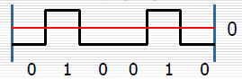
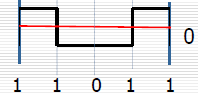
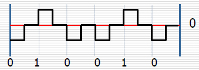
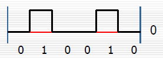
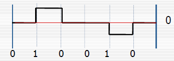
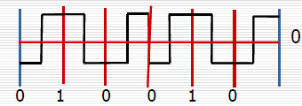

# 物理层

### 极化编码

##### NRZ(None-Return to Zero) 不归零制码

（1）不归零制电平编码

用零电平表示0，正电平表示1。

（2）不归零制反相编码

信号电平的一次翻转代表比特1，无电平变化代表0。

##### RZ(Return to Zero) 归零制码

用负电平表示“0”，正电平表示“1”（或相反），比特中位跳变到零电平，从而提供同步。

需要采用三个不同电平，两次信号变化来编码1比特，因此增加了占用的带宽。

## 单极性编码

单极性编码只使用一个极性，零电平表示0，正电平表示1。

## 双极性编码

双极性编码，1为反转，0为保持零电平。根据信号是否归零，还可以划分为归零码和非归零码，归零码码元中间的信号回归到0电平，非归零码遇1电平翻转，零时不变。作为编码方案的双极性不归零码,1码和0码都有电流，但是1码是正电流，0码是负电流，正和负的幅度相等，故称为双极性码。

##### AMI(Alternative Mark Inversion) 信号交替反转码

零电平表示0，正负电平的跃迁表示1，实现对1电平的交替反转。

##### B8ZS(Binary 8 Zero Substitution) 双极性8连0替换码

B8ZS是T1网路中的一种编码技术。当八个连续的零信号传送时，插入两个连续的同等电压，即双极置换。接收设备将双极置换编译为时间标记，保证传送设备与接收设备之间的同步。B8ZS基于一种早期的编码技术--信号交替反转技术（AMI）。AMI应用于电脑通讯数字服务，它是最早使用64Kbps信道的数据服务，目前仍有使用。这意味着总共失去了192kbps，每条信道只有56kbps真正用于数据的传输。B8ZS利用双极置换保证设备间的同步，且不需要额外的带宽，也就是说B8ZS技术可以使每条信道以全64kbps带宽进行数据传输。B8ZS与旧式的AMI设备不兼容。

##### HDB3(High-density Bipolar-3 Zeros) 3阶高密度双极性码

先将消息代码变换成AMI码，若AMI码中连0的个数小于4，此时的AMI码就是HDB3码。

若AMI码中连0的个数大于3，则将每4个连0小段的第4个0变换成与前一个非0符号（+1或-1）同极性的符号，表示(+1+,-1-)。

为了不破坏极性交替反转，当相邻符号之间有偶数个非0符号时，再将该小段的第1个0变换成+B或-B，符号的极性与前一非零符号的相反，并让后面的非零符号从符号开始再交替变化。

## 双相位编码

##### 曼彻斯特码

每一位中间都有一个跳变，从低跳到高表示0，从高跳到低表示1。

##### 差分曼彻斯特编码

每一位中间跳变表示时钟，每一位位前跳变表示数据，有跳变表示0，无跳变表示1。